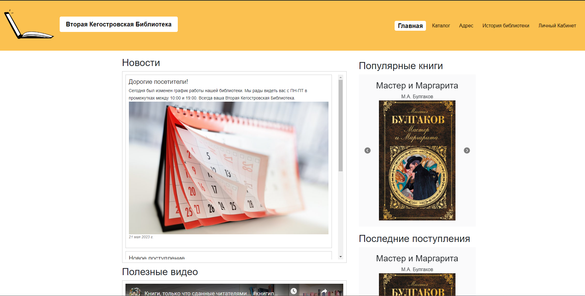

# Вторая Кегостровская Библиотека
[](https://github.com/alkogenius21/uppp_project)
[](https://github.com/alkogenius21/uppp_project)
Добро пожаловать в "Вторую Кегостровскую Библиотеку"! Это веб-приложение разработано на базе фреймворка Django и предоставляет удобный способ управления книгами.


## Особенности

- Управление книгами: добавление, редактирование и удаление книг из коллекции библиотеки.
- Поиск книг: возможность осуществлять поиск книг по названию, автору или жанру.
- Расширенная информация: предоставление подробной информации о каждой книге, включая обложку, аннотацию, издательство и год издания.
- Аутентификация пользователей: возможность регистрации пользователей и аутентификации для броинрования книг.
- Ролевая система: разграничение доступа на основе ролей пользователей, таких как администратор, библиотекарь и обычный пользователь.


## Используемые языки

В разработке "Второй Кегостровской Библиотеки" были использованы следующие языки:

- Python
- JavaScript
- HTML
- CSS

## Установка и запуск

1. Установите Python 3.9.13 на вашу систему. Вы можете скачать его с официального сайта Python: https://www.python.org/downloads/

2. Клонируйте репозиторий на свой локальный компьютер:

```bash
git clone https://github.com/alkogenius21/uppp_project.git
```
3. Перейдите в папку проекта:

```bash
cd uppp_project
```
4. Запустите виртуальную среду
- на Windows
```bash
virt\Scripts\activate.bat
```
- на Linux/MacOS
```bash
source virt/bin/activate
```
5. Установите зависимости, используя pip:
```bash
pip install -r requirements.txt
```
6. Запустите миграции базы данных:
```bash
python manage.py migrate
```
7. Запустите локальный сервер(порт можно указать любой):
```bash
python manage.py runserver 4500
```
8. Откройте веб-браузер и перейдите по адресу http://localhost:4500/ для доступа к "Второй Кегостровской Библиотеке".

## Требования

- Python 3.9.13
- Django (указана в файле requirements.txt)

## Авторы

- [Обухов Николай - старший программист](mailto:fairdanger43@gmail.com)
- [Хрушкой Виктор - старший веб-дизайнер](mailto:vkhrushkoy@gmail.com)

## Лицензия

Этот проект лицензирован по лицензии [MPL-2.0](https://www.mozilla.org/en-US/MPL/2.0/).

